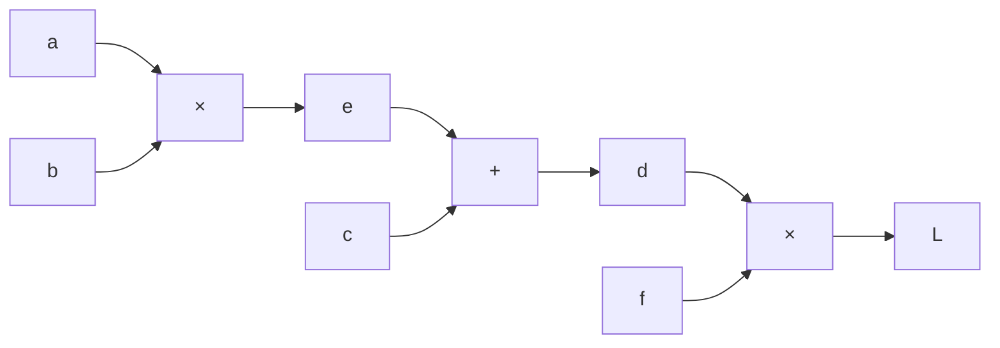
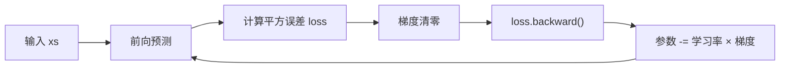

# zero-GPT · Lecture 1

从一个只保存标量的 `Value` 类出发，亲手实现动态计算图、反向传播、神经元、网络层和一个可训练的多层感知机（MLP）。本仓库整理自个人 `backward.ipynb` 学习代码，并对照 [karpathy/micrograd](https://github.com/karpathy/micrograd) 校正关键实现。

> 这一讲还没有实现 GPT。它先解决 GPT、CNN、MLP 都依赖的基础问题：模型怎样计算梯度，以及参数怎样根据梯度更新。

## 1. 快速复现

环境：Windows、Python 3.14、[uv](https://docs.astral.sh/uv/)。

```powershell
# 首次安装 uv
winget install --id astral-sh.uv -e

# 克隆并进入项目
git clone https://github.com/feng-nengyu/zero-GPT.git
cd zero-GPT

# 按 uv.lock 创建 .venv 并安装全部依赖
uv sync

# 运行完整源码（训练 + PyTorch 梯度对照）
uv run python lecture1.py

# 启动 Jupyter
uv run jupyter lab
```

计算图还需要 Windows Graphviz 程序。Python 包和 `dot.exe` 是两层依赖：

```powershell
winget install graphviz
dot -V
```

若 `dot -V` 找不到程序，把 `C:\Program Files\Graphviz\bin` 永久加入用户 `PATH`，重开 PowerShell 和 Jupyter。项目的 Python 内核应指向 `.venv\Scripts\python.exe`。

## 2. 这一讲搭出了什么


对应实现集中在一个主源码文件 [lecture1.py](lecture1.py)，并提供可从头运行的 [notebooks/backward.ipynb](notebooks/backward.ipynb)。完整结构是：

```text
Value                 标量、梯度、计算图和局部求导规则
trace / draw_dot      查看计算图
Module                参数管理与梯度清零
Neuron                w·x + b，再经过 tanh
Layer                 并排组合多个 Neuron
MLP                   顺序连接多个 Layer
train_demo            前向、损失、反向、参数更新
torch_reference       用 PyTorch 验证结果
```

## 3. `Value`：数据和梯度放在同一个对象里

```python
class Value:
    def __init__(self, data, _children=(), _op="", label=""):
        self.data = data
        self.grad = 0.0
        self._backward = lambda: None
        self._prev = set(_children)
        self._op = _op
        self.label = label
```

- `data`：前向传播算出的数值。
- `grad`：最终输出对当前值的导数，例如 `dL/da`。
- `_prev`：当前值直接依赖的上一层节点。
- `_op`：生成当前值的运算，仅用于调试和画图。
- `_backward`：当前节点怎样把 `out.grad` 传给父节点的局部规则。

赋值 `self.grad = 0.0` 会创建对象属性；前导单下划线表示“内部实现”，不是访问限制。`__init__`、`__add__` 这类前后双下划线名称则是 Python 规定的特殊接口。

## 4. 前向传播时，同时记录反向规则

以乘法为例：

```python
def __mul__(self, other):
    other = other if isinstance(other, Value) else Value(other)
    out = Value(self.data * other.data, (self, other), "*")

    def _backward():
        self.grad += other.data * out.grad
        other.grad += self.data * out.grad

    out._backward = _backward
    return out
```

前向阶段得到 `out = self × other`；内部函数通过闭包记住 `self`、`other`、`out`。反向阶段应用链式法则：

| 运算 | 局部导数 | 传回父节点的梯度 |
|---|---|---|
| `z = x + y` | `∂z/∂x = 1` | `x.grad += z.grad` |
| `z = x × y` | `∂z/∂x = y` | `x.grad += y.data × z.grad` |
| `z = xⁿ` | `∂z/∂x = n xⁿ⁻¹` | `x.grad += n xⁿ⁻¹ × z.grad` |
| `z = tanh(x)` | `∂z/∂x = 1-z²` | `x.grad += (1-z²) × z.grad` |
| `z = exp(x)` | `∂z/∂x = exp(x)` | `x.grad += z.data × z.grad` |

这里必须使用 `+=`。一个变量可能经多条路径影响损失，来自各路径的梯度需要相加，不能互相覆盖。

除法不必单独推导：

```python
def __truediv__(self, other):
    return self * other**-1
```

即 `a / b = a × b⁻¹`，已有的乘法和幂运算会共同完成前向与反向传播。

## 5. 为什么反向传播需要拓扑排序

计算 `L = (a × b + c) × f` 时，必须先得到 `L.grad`，才能计算 `d.grad`，再继续计算 `a.grad`。因此先从输出递归收集节点，再倒序执行每个节点的 `_backward()`。



```python
build_topo(self)
self.grad = 1.0           # dL/dL = 1
for node in reversed(topo):
    node._backward()
```

`_backward()` 只处理当前节点到直接父节点的一步；公开的 `backward()` 负责按正确顺序处理整张图。

## 6. 从神经元到 MLP

一个神经元计算：

```text
out = tanh(w₁x₁ + w₂x₂ + ... + b)
```

```python
activation = sum(
    (weight * value for weight, value in zip(self.w, x)),
    self.b,
)
return activation.tanh()
```

`Layer(3, 4)` 表示 4 个并排的神经元，每个神经元都接收完整的 3 个输入。`MLP(3, [4, 4, 1])` 则依次创建 `Layer(3,4)`、`Layer(4,4)`、`Layer(4,1)`。


该模型共有 `4×(3+1) + 4×(4+1) + 1×(4+1) = 41` 个参数；每个括号中的 `+1` 是偏置。

## 7. 一轮训练的完整逻辑

```python
predictions = [model(x) for x in xs]
loss = sum((prediction - target) ** 2
           for target, prediction in zip(ys, predictions))

model.zero_grad()
loss.backward()

for parameter in model.parameters():
    parameter.data -= learning_rate * parameter.grad
```



梯度指向损失上升最快的方向，所以参数要减去梯度。学习率控制每一步大小；太小收敛慢，太大可能震荡或发散。

## 8. PyTorch 对照

PyTorch 的 `Tensor` 相当于可批量存数的工业版 `Value`：

```python
x = torch.tensor([2.0], dtype=torch.float64, requires_grad=True)
y = x**2
y.backward()
print(x.grad.item())  # 4.0
```

- `requires_grad=True`：要求 PyTorch 记录计算图。
- `backward()`：自动执行反向模式自动微分。
- `float64`：用于和 Python 标量实现精确对照；实际深度学习通常使用更快、更省内存的 `float32`。

## 9. 最容易踩的坑

1. 特殊方法必须前后各两个下划线：`__init__`，不是 `_init_`。
2. 调用方法要写括号：`n.tanh()`；`n.tanh` 只是方法对象。
3. `out._backward = _backward` 要放在内部函数定义之后，名称不能写成 `_backgrad`。
4. 每轮反向传播前必须清空旧梯度，否则 `+=` 会把多轮训练的梯度累积起来。
5. 预测变量统一用 `ypred`；原 notebook 的 `yred` 是拼写错误。
6. `zip()` 会静默截断较长列表，所以源码增加了输入长度断言。
7. 随机初始化导致每次初始输出不同；复现实验先执行 `random.seed(42)`。
8. Jupyter 修改类后要重新运行类定义并重建对象，必要时执行“Restart Kernel and Run All”。
9. `graphviz` Python 包不包含 `dot.exe`；能 `import graphviz` 不等于能渲染图片。
10. 不要用 `.data` 绕过 PyTorch 自动求导做计算；这里只在手写引擎的参数更新阶段直接修改 `Value.data`。

## 10. 复习顺序

建议按以下顺序重写，而不是背代码：

1. `Value.__init__` 与 `__repr__`
2. `__add__`、`__mul__` 和闭包 `_backward`
3. `__pow__`、`tanh`、运算符反向接口
4. 拓扑排序和 `backward`
5. 用 PyTorch 验证一个神经元的梯度
6. `Neuron → Layer → MLP`
7. 平方误差、梯度清零和参数更新

参考资料：[karpathy/micrograd](https://github.com/karpathy/micrograd)（MIT License）。本仓库是面向复习与复现的 Lecture 1 学习实现，不追求生产性能。
